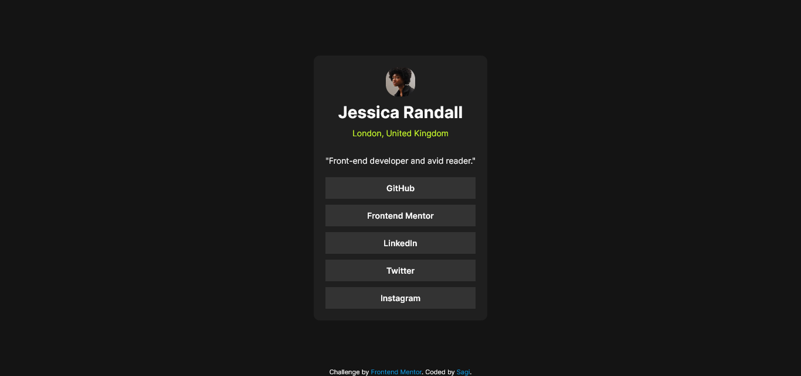

# Frontend Mentor - Social links profile solution

This is a solution to the [Social links profile challenge on Frontend Mentor](https://www.frontendmentor.io/challenges/social-links-profile-UG32l9m6dQ). Frontend Mentor challenges help you improve your coding skills by building realistic projects. 

## Table of contents

- [Overview](#overview)
  - [The challenge](#the-challenge)
  - [Screenshot](#screenshot)
  - [Links](#links)
- [My process](#my-process)
  - [Built with](#built-with)
  - [What I learned](#what-i-learned)
  - [Continued development](#continued-development)
  - [Useful resources](#useful-resources)
- [Author](#author)
- [Acknowledgments](#acknowledgments)

**Note: Delete this note and update the table of contents based on what sections you keep.**

## Overview

### The challenge

Users should be able to:

- See hover and focus states for all interactive elements on the page

### Screenshot


### Links

- Solution URL: [Add solution URL here](https://your-solution-url.com)
- Live Site URL: [Live site URL here](https://ratsagi.github.io/social-links-profile-fem/)

## My process

### Built with

- Semantic HTML5 markup
- CSS custom properties
- Flexbox
### What I learned
I used to have figma file from previous challenges so It was challenging at first how to get a right size then I had a look at the design of qr code component and noticed  the similarites of the size of their container and I use it as an example after I just worked with jpg so the key point here is I could learn to use my best jugment of the size to create this project.
When I was styling the links and added background color it didn't take full width so I was a bit confused then I undestood to use this:
```css
main a{
    width: 100%;    
}
```
I also learned about inheritance. I got to now that the parent properties like color  can be inherited to children by using value "inherit":
```css
main a{
    color: inherit;    
}
```
### Continued development
I will continue to explore and follow the learning path from frontend mentor to get more hands on experience. Also continue to use free plan which lets me improve my jugment skill to recognize the sizes and other stuff. I think this is the most important skill in frontend development.
**Note: Delete this note and the content within this section and replace with your own plans for continued development.**

### Useful resources

- [Example resource 1](https://www.example.com) - This helped me for XYZ reason. I really liked this pattern and will use it going forward.
- [Example resource 2](https://www.example.com) - This is an amazing article which helped me finally understand XYZ. I'd recommend it to anyone still learning this concept.

**Note: Delete this note and replace the list above with resources that helped you during the challenge. These could come in handy for anyone viewing your solution or for yourself when you look back on this project in the future.**

## Author

- Website - [Sagi](https://github.com/ratsagi)
- Frontend Mentor - [@yourusername](https://www.frontendmentor.io/profile/ratsagi)
- Twitter - [@Sagi31758105](https://www.twitter.com/Sagi31758105)

**Note: Delete this note and add/remove/edit lines above based on what links you'd like to share.**

## Acknowledgments

This is where you can give a hat tip to anyone who helped you out on this project. Perhaps you worked in a team or got some inspiration from someone else's solution. This is the perfect place to give them some credit.

**Note: Delete this note and edit this section's content as necessary. If you completed this challenge by yourself, feel free to delete this section entirely.**
